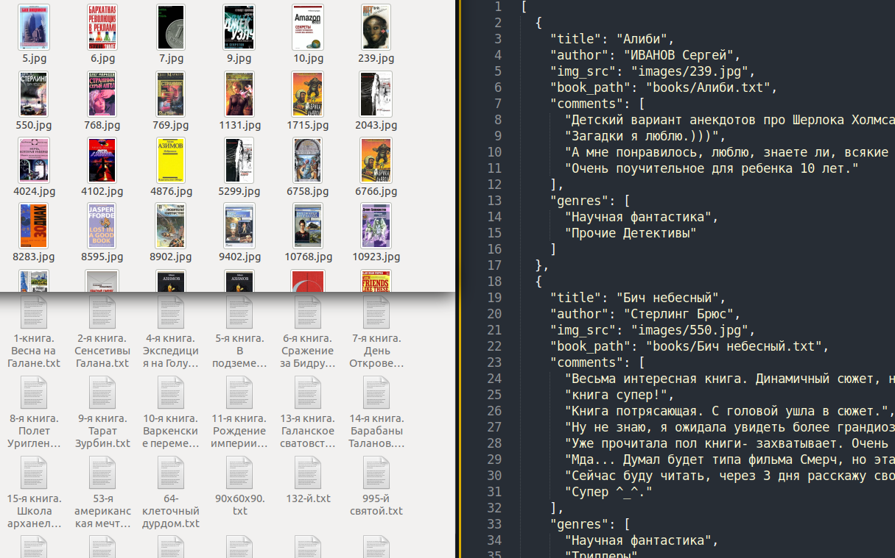

# Парсер книг с сайта tululu.org

Данный скрипт скачивает книги определенного жанра с сайта [tululu.org](http://tululu.org/).  
А именно: текст, обложку, комментарии и т.д.



### Как установить

Python3 должен быть уже установлен. 
Затем используйте `pip` (или `pip3`, есть конфликт с Python2) для установки зависимостей:
```
pip install -r requirements.txt
```

### Аргументы

* `genre_id` - id жанра ( [tululu.org/l**55**/](http://tululu.org/l55/) ) (значение по умолчанию: *55*)
* `start_page` - начальная страница скачивания (значение по умолчанию: *1*)    
 пример: [tululu.org/l55/**1**/](http://tululu.org/l55/1/)
* `end_page` - конечная страница скачивания (значение по умолчанию: *1*)  
 пример: [tululu.org/l55/**20**/](http://tululu.org/l55/20/)
* `all_books` - скачать ВСЕ книги выбранного жанра
* `dest_folder` — путь к каталогу с результатами парсинга: картинкам, книгам, JSON. (значение по умолчанию: *downloads*)
* `skip_imgs` — не скачивать картинки 
* `skip_txt` — не скачивать книги
* `json_path` — указать свой путь к *.json файлу с результатами (значение по умолчанию: *jsons*)

### Примеры запуска:
скачать книги жанра *научная фантастика*, первую страницу, в папку *downloads*
```
python parse_tululu_category.py
```
скачать книги жанра *детская фантастика*, с 5-й по 7-ю страницу, в папку *my_downloads*, без обложек

```
python parse_tululu_category.py --genre_id 17 --start_page 5 --end_page 7 --dest_folder my_downloads --skip_imgs
```
### Цель проекта

Код написан в образовательных целях на онлайн-курсе для веб-разработчиков 
[dvmn.org](https://dvmn.org/modules/website-layout-for-pydev/).
